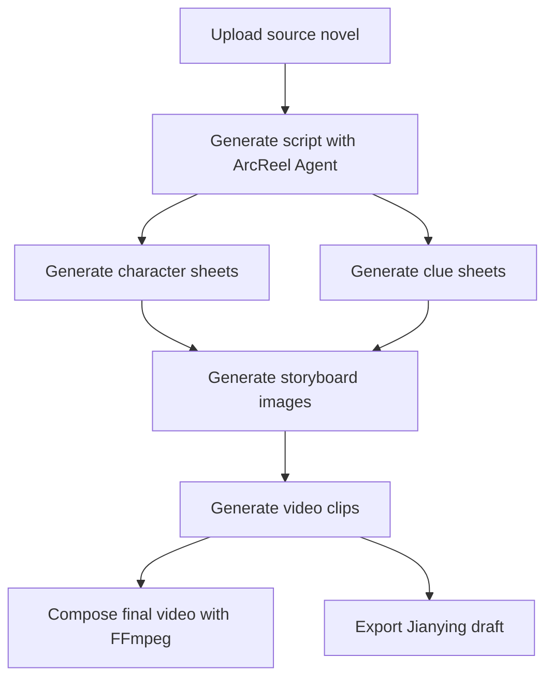
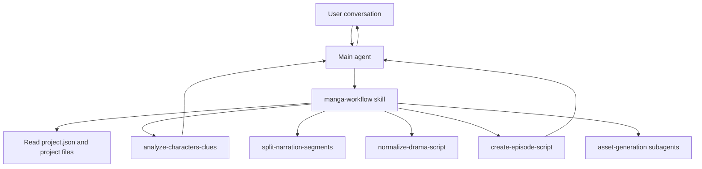

<h1 align="center">
  <br>
  <picture>
    <source media="(prefers-color-scheme: light)" srcset="frontend/public/android-chrome-maskable-512x512.png">
    <source media="(prefers-color-scheme: dark)" srcset="frontend/public/android-chrome-512x512.png">
    
  </picture>
  <br>
  ArcReel
  <br>
</h1>

<h4 align="center">Open-source AI video creation workspace for turning novels into short-form video productions</h4>

<p align="center">
  <a href="#quick-start"></a>
  <a href="https://github.com/ArcReel/ArcReel/blob/main/LICENSE"></a>
  <a href="https://github.com/ArcReel/ArcReel"></a>
  <a href="https://github.com/ArcReel/ArcReel/pkgs/container/arcreel"></a>
  <a href="https://github.com/ArcReel/ArcReel/actions/workflows/test.yml"></a>
</p>

<p align="center">
  
  
  
  
  
  
  
  
</p>

<p align="center">
  
</p>

---

## Overview

ArcReel is an AI-assisted production workspace for adapting novels into short-form videos. It combines a web studio, async generation pipelines, provider-agnostic media backends, and an agent workflow that helps move a project from source material to editable outputs.

Core capabilities include:

- Agent-guided workflow from source material to scripts, storyboard images, video clips, and exports
- Multi-provider image, video, and text generation with project-level and global overrides
- Character sheets and clue tracking to keep continuity across scenes and episodes
- Async task queues, version history, asset recovery, and SSE-based progress updates
- Cost tracking and cost estimation across providers and media types
- Project import/export and Jianying draft export for downstream editing

## Workflow



## Quick Start

### Default deployment (SQLite)

```bash
git clone https://github.com/ArcReel/ArcReel.git
cd ArcReel/deploy
cp .env.example .env
docker compose up -d
```

Then open `http://localhost:1241`.

### Production deployment (PostgreSQL)

```bash
cd ArcReel/deploy/production
cp .env.example .env   # set POSTGRES_PASSWORD
docker compose up -d
```

After first startup, sign in with the default username `admin`. The password comes from `AUTH_PASSWORD` in `.env`; if it is left empty, ArcReel generates one on first startup and writes it back to `.env`.

Then finish setup in the settings page (`/settings`):

1. Configure the ArcReel Agent credentials and model settings.
2. Configure at least one image/video/text provider, or add a custom compatible provider.

For a fuller walkthrough, see [docs/getting-started.md](docs/getting-started.md).

## English-Only Project Migration

ArcReel now uses an English-only project contract.

Upgraded runtime APIs require:

- `project.json` to contain `"language": "en"`
- English-only `scene_type` values: `story` and `establishing`

Before opening legacy Chinese-first projects in the upgraded app, run:

```bash
uv run python -m scripts.migrate_project_language \
  --projects-root ./projects \
  --target-lang en \
  --include-source \
  --write
```

Migration notes:

- Project metadata, scripts, drafts, and optional source text files are translated in place.
- Technical identifiers such as project directory names, asset paths, JSON keys, IDs, and provider/model identifiers are preserved.
- A backup snapshot is created before each project rewrite.
- Unmigrated projects fail fast at runtime until migration is complete.

## Feature Highlights

- End-to-end production flow from novel to script to assets to final video
- Multi-agent architecture using Claude Agent SDK, skills, and focused subagents
- Narration mode and drama mode for different storytelling structures
- Progressive episode planning for long-form source material
- Style reference image analysis and reuse across generated assets
- Character consistency and clue continuity across scenes and episodes
- Version history with rollback for storyboard, video, character, and clue assets
- Provider-aware cost tracking and pre-generation cost estimation
- Project import/export for backup and migration
- Jianying draft export for editing in Jianying 5.x or 6+

## Provider Support

ArcReel uses shared `ImageBackend`, `VideoBackend`, and `TextBackend` interfaces so you can switch providers globally or per project.

### Built-in image providers

- Gemini
- Volcengine Ark
- Grok
- OpenAI

### Built-in video providers

- Gemini Veo 3.1 family
- Volcengine Ark Seedance family
- Grok video models
- OpenAI Sora 2 family

### Built-in text providers

- Gemini
- Volcengine Ark
- Grok
- OpenAI

### Custom providers

ArcReel can also connect to OpenAI-compatible and Google-compatible APIs, including self-hosted or third-party endpoints. Custom providers support model discovery, media-type assignment, project/global selection, and the same asset-management flows used by built-in providers.

## Agent Architecture

ArcReel's assistant is built on Claude Agent SDK and uses an orchestration-skill plus focused-subagent model.



Design principles:

- The orchestration skill detects project state and dispatches the right focused subagent.
- Each focused subagent completes one bounded task and returns a compact summary.
- Deterministic scripting stays in skills; reasoning-heavy analysis stays in subagents.
- Users confirm stage outputs before the workflow advances.

## Architecture

- Frontend: React 19, TypeScript, Vite, Tailwind CSS 4, zustand, Framer Motion
- Backend: FastAPI, Python 3.12+, Pydantic 2, uvicorn
- Agent runtime: Claude Agent SDK
- Media processing: FFmpeg, Pillow
- Storage: SQLite by default, PostgreSQL for production, SQLAlchemy + Alembic
- Authentication: JWT, API keys, Argon2 password hashing
- Deployment: Docker and Docker Compose

## Documentation

- [Getting started](docs/getting-started.md)
- [Jianying export guide](docs/jianying-export-guide.md)
- [Contributing](CONTRIBUTING.md)

## Community

A community QR code is available below if you want to join the project chat group.

<p align="center">
  
</p>

## License

This project is licensed under the [AGPL-3.0 License](LICENSE).
